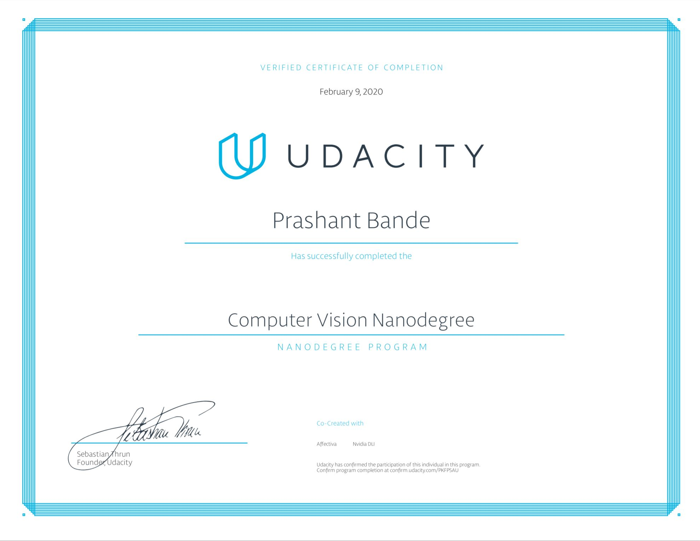

# Udacity - Computer Vision Nanodegree

# Projects of Computer Vision Nanodegree

1. [Facial Keypoints Detection](https://github.com/udacity/P1_Facial_Keypoints)

2. [Image Captioning](https://github.com/udacity/CVND---Image-Captioning-Project)

3. [Landmark Detection - Tracking](https://github.com/udacity/CVND_Localization_Exercises/tree/master/Project_Landmark%20Detection)
